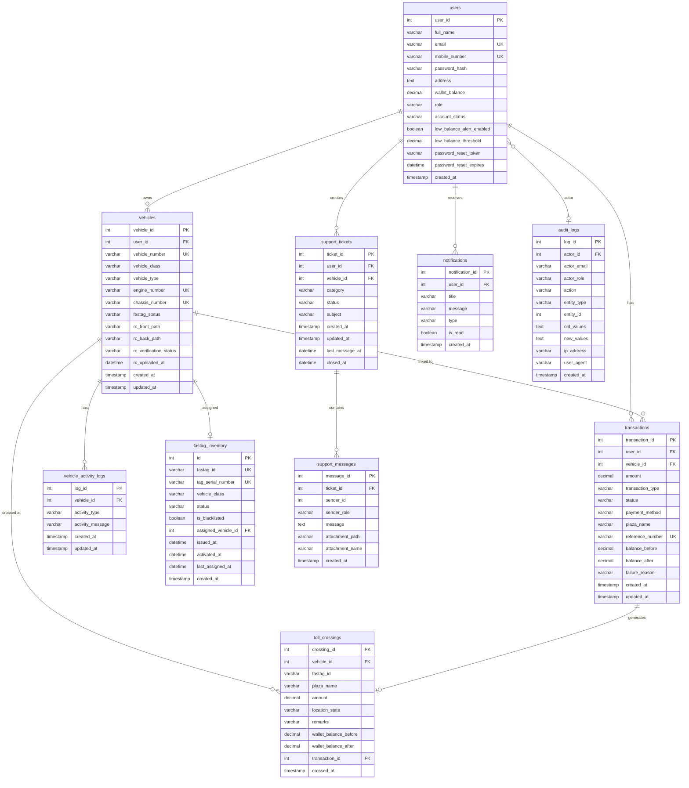

# FASTag Portal — Database Schema Documentation

## Database: `fastag_portal` (MySQL)

---

## Entity Relationship Diagram



---

## Table Definitions

### 1. `users`

The central identity table. Stores both regular users and admin accounts.

| Column | Type | Constraints | Default | Description |
|---|---|---|---|---|
| `user_id` | INT | PK, AUTO_INCREMENT | — | Primary key |
| `full_name` | VARCHAR(100) | NOT NULL | — | User's full name |
| `email` | VARCHAR(100) | NOT NULL, UNIQUE, INDEX | — | Login identifier |
| `mobile_number` | VARCHAR(15) | NOT NULL, UNIQUE, INDEX | — | Mobile number |
| `password_hash` | VARCHAR(255) | NOT NULL | — | bcrypt hash |
| `address` | TEXT | NULLABLE | NULL | Optional address |
| `wallet_balance` | DECIMAL(10,2) | — | `0.00` | Prepaid wallet balance |
| `role` | VARCHAR(20) | NOT NULL | `'USER'` | `USER` or `ADMIN` |
| `account_status` | VARCHAR(20) | NOT NULL | `'ACTIVE'` | `ACTIVE`, `SUSPENDED`, `DISABLED` |
| `low_balance_alert_enabled` | BOOLEAN | — | `0` (false) | Alert toggle |
| `low_balance_threshold` | DECIMAL(10,2) | — | `100.00` | Balance alert threshold |
| `password_reset_token` | VARCHAR(255) | NULLABLE, INDEX | NULL | One-time reset token |
| `password_reset_expires` | DATETIME | NULLABLE | NULL | Token expiry (15 min) |
| `created_at` | TIMESTAMP | — | `CURRENT_TIMESTAMP` | Registration timestamp |

**Relationships**:
- One-to-Many → `vehicles` (cascade delete)
- One-to-Many → `transactions`, `support_tickets`, `notifications`
- Referenced by → `audit_logs.actor_id`

**Business Rules**:
- `email` and `mobile_number` must be globally unique
- `role` determines access level: USER can access user endpoints, ADMIN can access admin endpoints
- `account_status = SUSPENDED/DISABLED` blocks admin login
- `wallet_balance` is the authoritative balance source — updated atomically during recharge/toll
- `password_reset_token` is nullified immediately after use (single-use guarantee)

---

### 2. `vehicles`

Stores registered vehicles linked to users.

| Column | Type | Constraints | Default | Description |
|---|---|---|---|---|
| `vehicle_id` | INT | PK, AUTO_INCREMENT | — | Primary key |
| `user_id` | INT | FK → users.user_id, NOT NULL, ON DELETE CASCADE | — | Owner reference |
| `vehicle_number` | VARCHAR(20) | NOT NULL, UNIQUE, INDEX | — | Registration number (e.g., KA01AB1234) |
| `vehicle_class` | VARCHAR(10) | NOT NULL | — | VC4, VC5, VC7, VC12, VC16 |
| `vehicle_type` | VARCHAR(50) | NULLABLE | NULL | e.g., "Sedan", "SUV", "Truck" |
| `engine_number` | VARCHAR(100) | NOT NULL, UNIQUE | — | Engine identification |
| `chassis_number` | VARCHAR(100) | NOT NULL, UNIQUE | — | Chassis identification |
| `fastag_status` | VARCHAR(30) | — | `'INACTIVE'` | See lifecycle below |
| `rc_front_path` | VARCHAR(255) | NULLABLE | NULL | Relative path to RC front image |
| `rc_back_path` | VARCHAR(255) | NULLABLE | NULL | Relative path to RC back image |
| `rc_verification_status` | VARCHAR(30) | — | `'PENDING'` | `PENDING`, `VERIFIED`, `REJECTED` |
| `rc_uploaded_at` | DATETIME | NULLABLE | NULL | Last RC upload timestamp |
| `created_at` | TIMESTAMP | — | `CURRENT_TIMESTAMP` | Registration timestamp |
| `updated_at` | TIMESTAMP | — | `CURRENT_TIMESTAMP` ON UPDATE | Last modification |

**Business Rules**:
- `vehicle_number`, `engine_number`, `chassis_number` must each be globally unique
- `vehicle_class` determines which FASTag inventory tags can be matched
- `rc_front_path` and `rc_back_path` are cleared when admin requests re-upload
- Vehicle appears in admin review queue only when both RC paths are non-null AND status is PENDING

---

### 3. `transactions`

Records all financial transactions (recharges and toll deductions).

| Column | Type | Constraints | Default | Description |
|---|---|---|---|---|
| `transaction_id` | INT | PK, AUTO_INCREMENT | — | Primary key |
| `user_id` | INT | FK → users.user_id, NOT NULL, ON DELETE CASCADE | — | Transaction owner |
| `vehicle_id` | INT | FK → vehicles.vehicle_id, NULLABLE, ON DELETE CASCADE | NULL | Associated vehicle |
| `amount` | DECIMAL(10,2) | NOT NULL | — | Transaction amount |
| `transaction_type` | VARCHAR(50) | NOT NULL | — | `TOLL_DEDUCTION` or `WALLET_RECHARGE` |
| `status` | VARCHAR(30) | NOT NULL | `'SUCCESS'` | `SUCCESS`, `FAILED`, `PENDING` |
| `payment_method` | VARCHAR(50) | NULLABLE | NULL | e.g., "UPI", "Credit Card" |
| `plaza_name` | VARCHAR(255) | NULLABLE | NULL | Toll plaza name (for tolls) |
| `reference_number` | VARCHAR(100) | NULLABLE, UNIQUE | NULL | TXN... or TOLL... prefix |
| `balance_before` | DECIMAL(10,2) | NULLABLE | NULL | Wallet balance before txn |
| `balance_after` | DECIMAL(10,2) | NULLABLE | NULL | Wallet balance after txn |
| `failure_reason` | VARCHAR(255) | NULLABLE | NULL | e.g., INSUFFICIENT_BALANCE, FASTAG_DISABLED, RC_UNVERIFIED |
| `created_at` | TIMESTAMP | — | `CURRENT_TIMESTAMP` | Transaction timestamp |
| `updated_at` | TIMESTAMP | — | `CURRENT_TIMESTAMP` ON UPDATE | Last modification |

**Business Rules**:
- `balance_before` and `balance_after` are only set for SUCCESS transactions
- `failure_reason` is only set for FAILED transactions
- `reference_number` format: `TXN` + 7 random chars (recharge) or `TOLL` + 6 random chars (toll)
- `payment_method` is only relevant for WALLET_RECHARGE transactions
- FAILED toll transactions are recorded for audit trail even though no money moves

---

### 4. `toll_crossings`

Detailed toll crossing records (only for successful crossings).

| Column | Type | Constraints | Default | Description |
|---|---|---|---|---|
| `crossing_id` | INT | PK, AUTO_INCREMENT | — | Primary key |
| `vehicle_id` | INT | FK → vehicles.vehicle_id, NOT NULL, ON DELETE CASCADE | — | Vehicle that crossed |
| `fastag_id` | VARCHAR(20) | NOT NULL | — | FASTag ID used at crossing |
| `plaza_name` | VARCHAR(255) | NOT NULL | — | Toll plaza name |
| `amount` | NUMERIC(10,2) | NOT NULL | — | Deducted amount |
| `location_state` | VARCHAR(100) | NULLABLE | NULL | State of the toll plaza |
| `remarks` | VARCHAR(255) | NULLABLE | NULL | Optional crossing notes |
| `wallet_balance_before` | NUMERIC(10,2) | NOT NULL | — | Balance snapshot before |
| `wallet_balance_after` | NUMERIC(10,2) | NOT NULL | — | Balance snapshot after |
| `transaction_id` | INT | FK → transactions.transaction_id, NOT NULL, ON DELETE CASCADE | — | Linked transaction |
| `crossed_at` | DATETIME | — | `CURRENT_TIMESTAMP` | Crossing timestamp |

**Business Rules**:
- Only created for SUCCESSFUL toll crossings (failed crossings only create Transaction records)
- `fastag_id` is captured from the active inventory tag at crossing time
- Linked 1:1 with a Transaction record via `transaction_id`

---

### 5. `fastag_inventory`

FASTag warehouse inventory — tracks all physical RFID tags.

| Column | Type | Constraints | Default | Description |
|---|---|---|---|---|
| `id` | INT | PK, AUTO_INCREMENT | — | Primary key |
| `fastag_id` | VARCHAR(20) | NOT NULL, UNIQUE, INDEX | — | 12-digit FASTag ID (starts with "31") |
| `tag_serial_number` | VARCHAR(50) | NOT NULL, UNIQUE | — | Format: NETC-FT-XXXXXXXX |
| `vehicle_class` | VARCHAR(10) | NOT NULL | — | VC4, VC5, VC6, VC7, VC12, VC16 |
| `status` | VARCHAR(30) | NOT NULL | `'UNASSIGNED'` | See lifecycle below |
| `is_blacklisted` | BOOLEAN | — | `false` | Blacklist flag |
| `assigned_vehicle_id` | INT | FK → vehicles.vehicle_id, NULLABLE, ON DELETE SET NULL | NULL | Currently assigned vehicle |
| `issued_at` | DATETIME | NULLABLE | NULL | When tag was issued |
| `activated_at` | DATETIME | NULLABLE | NULL | When tag was activated |
| `last_assigned_at` | DATETIME | NULLABLE | NULL | Last assignment timestamp |
| `created_at` | TIMESTAMP | — | `CURRENT_TIMESTAMP` | Inventory entry timestamp |

**Business Rules**:
- `status` values: UNASSIGNED, ASSIGNED, ACTIVE, DISABLED, BLACKLISTED, REPLACED, DAMAGED
- Only UNASSIGNED tags can be assigned to vehicles
- `assigned_vehicle_id` is NULL for UNASSIGNED, BLACKLISTED, REPLACED, DAMAGED tags
- `is_blacklisted` is set to true only when action=BLACKLIST
- Tags are matched to vehicles by `vehicle_class` during assignment (fallback to any class)
- When a tag is REPLACED, the old tag's `assigned_vehicle_id` is set to NULL

---

### 6. `support_tickets`

Support ticket headers.

| Column | Type | Constraints | Default | Description |
|---|---|---|---|---|
| `ticket_id` | INT | PK, AUTO_INCREMENT | — | Primary key |
| `user_id` | INT | FK → users.user_id, NOT NULL, INDEX, ON DELETE CASCADE | — | Ticket creator |
| `vehicle_id` | INT | FK → vehicles.vehicle_id, NULLABLE, INDEX, ON DELETE SET NULL | NULL | Related vehicle |
| `category` | VARCHAR(50) | NOT NULL | — | See categories below |
| `status` | VARCHAR(20) | NOT NULL, INDEX | `'OPEN'` | See lifecycle below |
| `subject` | VARCHAR(200) | NOT NULL | — | Ticket subject line |
| `created_at` | TIMESTAMP | — | `CURRENT_TIMESTAMP` | Creation timestamp |
| `updated_at` | TIMESTAMP | — | `CURRENT_TIMESTAMP` ON UPDATE | Last modification |
| `last_message_at` | DATETIME | NULLABLE | NULL | Last message timestamp (for sorting) |
| `closed_at` | DATETIME | NULLABLE | NULL | Only set when status=CLOSED |

**Categories**: `FASTAG_ISSUE`, `RC_VERIFICATION`, `WALLET_ISSUE`, `TOLL_DEDUCTION`, `REPLACEMENT_REQUEST`, `ACCOUNT_ISSUE`, `OTHER`

---

### 7. `support_messages`

Individual messages within a support ticket thread.

| Column | Type | Constraints | Default | Description |
|---|---|---|---|---|
| `message_id` | INT | PK, AUTO_INCREMENT | — | Primary key |
| `ticket_id` | INT | FK → support_tickets.ticket_id, NOT NULL, INDEX, ON DELETE CASCADE | — | Parent ticket |
| `sender_id` | INT | NULLABLE | NULL | User or admin ID (no FK) |
| `sender_role` | VARCHAR(20) | NOT NULL | — | `USER` or `ADMIN` |
| `message` | TEXT | NOT NULL | — | Message content |
| `attachment_path` | VARCHAR(255) | NULLABLE | NULL | Relative file path |
| `attachment_name` | VARCHAR(255) | NULLABLE | NULL | Original filename |
| `created_at` | TIMESTAMP | — | `CURRENT_TIMESTAMP` | Message timestamp |

**Design Decision**: `sender_id` has no FK constraint — `sender_role` disambiguates whether it's a user or admin ID.

---

### 8. `notifications`

In-app notification system.

| Column | Type | Constraints | Default | Description |
|---|---|---|---|---|
| `notification_id` | INT | PK, AUTO_INCREMENT | — | Primary key |
| `user_id` | INT | FK → users.user_id, NOT NULL, ON DELETE CASCADE | — | Recipient user |
| `title` | VARCHAR(100) | NOT NULL | — | Notification title |
| `message` | VARCHAR(255) | NOT NULL | — | Notification body |
| `type` | VARCHAR(50) | NOT NULL | — | WALLET, VEHICLE, SYSTEM, SUPPORT |
| `is_read` | BOOLEAN | — | `false` | Read status |
| `created_at` | TIMESTAMP | — | `CURRENT_TIMESTAMP` | Creation timestamp |

---

### 9. `vehicle_activity_logs`

Chronological activity feed per vehicle.

| Column | Type | Constraints | Default | Description |
|---|---|---|---|---|
| `log_id` | INT | PK, AUTO_INCREMENT | — | Primary key |
| `vehicle_id` | INT | FK → vehicles.vehicle_id, NOT NULL, ON DELETE CASCADE | — | Subject vehicle |
| `activity_type` | VARCHAR(50) | NOT NULL | — | See types below |
| `activity_message` | VARCHAR(255) | NOT NULL | — | Human-readable description |
| `created_at` | TIMESTAMP | — | `CURRENT_TIMESTAMP` | Activity timestamp |
| `updated_at` | TIMESTAMP | — | `CURRENT_TIMESTAMP` ON UPDATE | — |

**Activity Types**: `VEHICLE_ADDED`, `RC_FRONT_UPLOADED`, `RC_BACK_UPLOADED`, `RC_VERIFIED`, `RC_REJECTED`, `RC_REVIEW_REQUESTED`, `FASTAG_ENABLED`, `FASTAG_DISABLED`, `FASTAG_REPLACED`, `FASTAG_BLACKLISTED`, `FASTAG_DAMAGED`, `FASTAG_UNLINKED`, `FASTAG_UPDATED`, `FASTAG_STATUS_UPDATED`, `FASTAG_ASSIGNMENT_PENDING`, `WALLET_RECHARGE`, `TOLL_CROSSED`, `RC_FRONT_REMOVED_BY_ADMIN`, `RC_BACK_REMOVED_BY_ADMIN`

---

### 10. `audit_logs`

Immutable system-wide audit trail.

| Column | Type | Constraints | Default | Description |
|---|---|---|---|---|
| `log_id` | INT | PK, AUTO_INCREMENT | — | Primary key |
| `actor_id` | INT | FK → users.user_id, NULLABLE, ON DELETE SET NULL | NULL | Who performed the action |
| `actor_email` | VARCHAR(100) | NULLABLE, INDEX | NULL | Actor's email (denormalized) |
| `actor_role` | VARCHAR(20) | NULLABLE | NULL | USER, ADMIN, or SYSTEM |
| `action` | VARCHAR(100) | NOT NULL, INDEX | — | Action identifier |
| `entity_type` | VARCHAR(50) | NULLABLE, INDEX | NULL | Target entity type |
| `entity_id` | INT | NULLABLE, INDEX | NULL | Target entity ID |
| `old_values` | TEXT | NULLABLE | NULL | Previous state (JSON) |
| `new_values` | TEXT | NULLABLE | NULL | New state (JSON) |
| `ip_address` | VARCHAR(45) | NULLABLE | NULL | Client IP address |
| `user_agent` | VARCHAR(255) | NULLABLE | NULL | Browser/client identifier |
| `created_at` | TIMESTAMP | NOT NULL | `CURRENT_TIMESTAMP` | Event timestamp |

**Key Design Decision**: Audit logs use an **independent database session** (`SessionLocal()`) to guarantee they are committed regardless of the main transaction's success/failure. The `old_values` and `new_values` are stored as JSON text strings.

---

## Lifecycle State Machines

### FASTag Lifecycle

```
                    ┌───────────────────────────────────────┐
                    │                                       │
    ┌──────────┐    │    ┌──────────┐    ┌──────────┐      │
    │UNASSIGNED│────┼───►│ ASSIGNED │───►│  ACTIVE  │      │
    │          │    │    │          │    │          │      │
    └────┬─────┘    │    └──────────┘    └────┬─────┘      │
         │          │                         │             │
         │          │    ┌──────────────┐     │             │
         │          │    │   DISABLED   │◄────┤             │
         │          │    └──────┬───────┘     │             │
         │          │           │             │             │
         │          │    ┌──────▼───────┐     │             │
         │          └────┤   REPLACED   │◄────┘             │
         │               └──────────────┘                   │
         │                                                  │
         │          ┌──────────────┐                        │
         ├─────────►│ BLACKLISTED  │◄───────────────────────┤
         │          └──────────────┘                        │
         │                                                  │
         │          ┌──────────────┐                        │
         └─────────►│   DAMAGED    │◄───────────────────────┘
                    └──────────────┘

    UNASSIGNED → ASSIGNED:       Auto-assigned on RC approval
    ASSIGNED → ACTIVE:           Admin enables or auto-activation
    ACTIVE → DISABLED:           Admin disables or vehicle disabled
    ACTIVE/ASSIGNED → REPLACED:  Admin replaces with new tag
    Any → BLACKLISTED:           Admin blacklists
    Any → DAMAGED:               Admin marks damaged
    BLACKLISTED/DAMAGED → UNASSIGNED: Admin reactivates
```

### Vehicle FASTag Status Lifecycle

```
    ┌──────────┐    RC Approved +     ┌──────────┐
    │ INACTIVE │───────────────────►  │  ACTIVE  │
    └──────────┘    Tag Assigned      └────┬─────┘
                                           │
                    Admin Disables    ┌─────▼─────┐
                    ◄─────────────────┤ DISABLED  │
                                      └───────────┘
                    
                    No Tag Available  ┌──────────────────┐
                    ◄─────────────────┤ FASTAG_PENDING   │
                                      └──────────────────┘
                    
                    User Request      ┌──────────────────┐
                    ◄─────────────────┤PENDING_REPLACEMENT│
                                      └──────────────────┘
```

### RC Verification Lifecycle

```
    ┌──────────┐
    │ PENDING  │◄──── Vehicle created / RC re-uploaded / Admin clears RC
    └────┬─────┘
         │
    Admin Reviews
         │
    ┌────┼────┐
    ▼         ▼
┌──────┐  ┌──────────┐
│VERIFY│  │ REJECTED │
│  ED  │  │          │
└──────┘  └──────────┘
    │         │
    │         └──► User re-uploads → PENDING
    │
    └──► FASTag auto-assigned → Vehicle ACTIVE
```

### Transaction Lifecycle

```
    Toll Request or Recharge Initiated
              │
    ┌─────────┼─────────┐
    ▼                   ▼
┌──────────┐      ┌──────────┐
│ SUCCESS  │      │  FAILED  │
│          │      │          │
│ Balance  │      │ Reason:  │
│ Updated  │      │ - RC_    │
│ TollCross│      │   UNVERI │
│ ing      │      │   FIED   │
│ Created  │      │ - FASTAG │
│          │      │   _DISAB │
│          │      │   LED    │
│          │      │ - INSUFF │
│          │      │   ICIENT │
│          │      │   _BALAN │
│          │      │   CE     │
└──────────┘      └──────────┘
```

### Support Ticket Lifecycle

```
    ┌──────┐    Admin Reply     ┌─────────────┐
    │ OPEN │──────────────────► │ IN_PROGRESS │
    └──────┘    (auto-           └──────┬──────┘
                transition)            │
                              Admin changes
                                       │
                              ┌────────┼────────┐
                              ▼                 ▼
                        ┌──────────┐     ┌──────────┐
                        │ RESOLVED │     │  CLOSED  │
                        └──────────┘     └──────────┘
                                               │
                                         Cannot reopen
                                         closed_at set

    Note: OPEN → IN_PROGRESS happens automatically on first admin reply
```

---

## Foreign Key Relationships Summary

| From Table | Column | To Table | Column | On Delete |
|---|---|---|---|---|
| `vehicles` | `user_id` | `users` | `user_id` | CASCADE |
| `transactions` | `user_id` | `users` | `user_id` | CASCADE |
| `transactions` | `vehicle_id` | `vehicles` | `vehicle_id` | CASCADE |
| `toll_crossings` | `vehicle_id` | `vehicles` | `vehicle_id` | CASCADE |
| `toll_crossings` | `transaction_id` | `transactions` | `transaction_id` | CASCADE |
| `fastag_inventory` | `assigned_vehicle_id` | `vehicles` | `vehicle_id` | SET NULL |
| `support_tickets` | `user_id` | `users` | `user_id` | CASCADE |
| `support_tickets` | `vehicle_id` | `vehicles` | `vehicle_id` | SET NULL |
| `support_messages` | `ticket_id` | `support_tickets` | `ticket_id` | CASCADE |
| `notifications` | `user_id` | `users` | `user_id` | CASCADE |
| `vehicle_activity_logs` | `vehicle_id` | `vehicles` | `vehicle_id` | CASCADE |
| `audit_logs` | `actor_id` | `users` | `user_id` | SET NULL |
