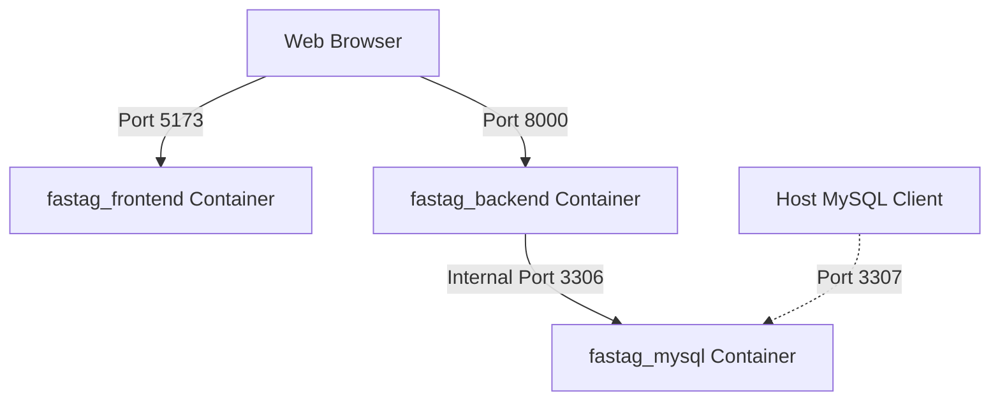

# Docker Containerization Setup

This document provides a comprehensive guide to running the **FASTag Management Portal** within a Dockerized environment.

---

## 🏛️ Architecture Overview

The system is split into three main containerized services that run in an isolated internal Docker network:

1. **Frontend (`fastag_frontend`)**: Runs the React/Vite SPA on Node 20.
2. **Backend (`fastag_backend`)**: Runs the FastAPI app on Python 3.11-slim. It maps backend routes, triggers audit logging, and communicates with the database container.
3. **Database (`fastag_mysql`)**: An official MySQL 8 database instance with persistent volume mapping.



---

## 📦 Services & Container Details

### 1. `fastag_frontend` (React + Vite)
- **Base Image**: `node:20`
- **Docker Context**: `./frontend`
- **Dockerignore**: Excludes local `node_modules` and compiled `dist` directory.
- **Port Mapping**: `5173:5173` (Exposed to Host)
- **Restart Policy**: `unless-stopped`

### 2. `fastag_backend` (FastAPI)
- **Base Image**: `python:3.11-slim`
- **Docker Context**: `./backend`
- **Dockerignore**: Excludes `.venv`, local `__pycache__`, `.env` files, and local `.db` databases.
- **Port Mapping**: `8000:8000` (Exposed to Host)
- **Restart Policy**: `unless-stopped`
- **Dependency Handling**: Configured with a healthcheck-dependent wait state `service_healthy` on MySQL to prevent startup race conditions.
- **Database Seeding & Migrations**: On container startup, the backend automatically runs `run_all_migrations.py` to create tables, run schema migrations, seed the initial Admin account (`admin@gitechnology.in` / password: `Admin@2026`), and seed 45 demo FASTags.

### 3. `fastag_mysql` (MySQL 8)
- **Base Image**: `mysql:8`
- **Environment**:
  - `MYSQL_ROOT_PASSWORD`: `root`
  - `MYSQL_DATABASE`: `fastag_portal`
- **Port Mapping**: `3307:3306` (Host port `3307` mapped to MySQL container port `3306` to prevent conflicts with other local MySQL instances running on `3306`).
- **Data Persistence**: Uses a named Docker volume (`mysql_data`) mapped to `/var/lib/mysql`.
- **Healthcheck**: Periodically runs `mysqladmin ping` to verify database readiness before dependent backend services initialize.

---

## 🛠️ Docker-Compose Workflows

### 1. Start Containers
To build the images and run the services in the background:
```bash
docker compose up --build -d
```
*(Remove the `-d` flag if you want to view logs in real-time).*

### 2. Check Status
Verify that all containers are running and healthy:
```bash
docker compose ps
```

### 3. View Logs
To view logs for all services or a specific service:
```bash
# All services
docker compose logs -f

# Backend service only
docker compose logs -f backend
```

### 4. Rebuild Containers
If you make changes to files that affect the build (e.g. `package.json`, `requirements.txt`, or Dockerfiles):
```bash
docker compose build --no-cache
docker compose up -d
```

### 5. Stop Containers
To stop and remove containers while preserving database volume data:
```bash
docker compose down
```

To stop and remove containers **along with** the persistent database volume data (Warning: this resets the DB):
```bash
docker compose down -v
```

---

## 🔍 Troubleshooting Notes

### 1. Database Host Connection Issues
If the backend cannot connect to MySQL, verify the environment variables loaded. 
- In Docker, the backend overrides `DB_HOST` to use `mysql` instead of `localhost` automatically via the `environment:` section in [docker-compose.yml](file:///c:/Gi%20Internship/docker-compose.yml).
- Do not override `DB_HOST` inside `backend/.env` to `mysql` if you want to preserve local (non-Dockerized) development compatibility on `localhost`.

### 2. Port Collisions
- The frontend runs on **5173**. If this is in use, you can adjust the host port mapping under the `frontend` service in `docker-compose.yml`.
- The MySQL container is mapped to **3307** on the host. If you have another local application using 3307, change the port mapping (e.g. `"3308:3306"`).

### 3. Docker build fails on dependencies
- Ensure you have generated the `backend/requirements.txt` file (already completed during initial configuration).
- If package installations fail, verify that your Docker runtime has network access to pull Node/Python modules.

### 4. Cryptography package error (caching_sha2_password)
- MySQL 8 uses `caching_sha2_password` as the default authentication mechanism. This requires the `cryptography` Python package on the client side (PyMySQL).
- This dependency is pre-configured in `backend/requirements.txt`. If you run into authentication errors after changing DB configurations, rebuild the backend using `docker compose build --no-cache backend`.
