# OWASP Top 10 Compliance Mapping & Gap Analysis

This report evaluates the security posture of the **FASTag Management Portal** codebase against the **OWASP Top 10 (2021)** web application security framework. It maps the security vulnerabilities identified in [SECURITY_REVIEW.md](file:///c:/Gi%20Internship/docs/SECURITY_REVIEW.md) to their corresponding OWASP categories, analyzes the architecture gaps, and provides defensive remediation requirements.

---

## 1. Executive Summary & Compliance Heatmap

The FASTag project currently exhibits security gaps in several critical areas, particularly in Access Control, Cryptography, Insecure Design, and Software/Data Integrity. Resolving these gaps is mandatory prior to production deployment.

### OWASP Top 10 (2021) Compliance Matrix

| OWASP Category | Status | Associated Issues | Risk Level | Gap Description |
| :--- | :--- | :--- | :--- | :--- |
| **A01:2021 – Broken Access Control** | ⚠️ **Partial** | **SEC-03**, **SEC-06** | **HIGH** | Static files accessible without auth (SEC-03); frontend route access secured with client-side guards & sessionStorage (SEC-06 resolved). |
| **A02:2021 – Cryptographic Failures** | ❌ **Non-Compliant** | **SEC-04**, **SEC-05** | **HIGH** | Default JWT secret keys embedded in code; plaintext storage of reset tokens in DB. |
| **A03:2021 – Injection** | ⚠️ **Partial** | *Potential Stored XSS via SEC-01* | **MEDIUM** | Lack of script/payload scanning on re-uploads could lead to SVG/HTML script injection. |
| **A04:2021 – Insecure Design** | ❌ **Non-Compliant** | **SEC-02**, **SEC-08** | **HIGH** | Concurrency race conditions in transactions; missing DB unique constraints on tag assignments. |
| **A05:2021 – Security Misconfiguration** | ❌ **Non-Compliant** | **SEC-07**, **SEC-10** | **MEDIUM** | Permissive wildcard CORS with credentials enabled; missing API rate limits. |
| **A06:2021 – Vulnerable & Outdated Components** | ⚠️ **Partial** | *General NPM/Pip checks* | **LOW** | Dependency manifest files lack pinning lockfiles in some builds. |
| **A07:2021 – Identification & Authentication** | ⚠️ **Partial** | **SEC-04**, **SEC-05**, **SEC-10** | **HIGH** | Lack of brute-force protection (rate limits); weak default credential signing fallback keys. |
| **A08:2021 – Software & Data Integrity Failures** | ❌ **Non-Compliant** | **SEC-01** | **HIGH** | Complete lack of file extension/type verification on RC re-upload endpoints. |
| **A09:2021 – Security Logging & Monitoring** | ⚠️ **Partial** | **SEC-09** | **MEDIUM** | Audit logging captures reverse proxy IP (`request.client.host`) instead of client IP. |
| **A10:2021 – Server-Side Request Forgery** | ✅ **Compliant** | *None identified* | **LOW** | No outbound HTTP triggers from client inputs. |

---

## 2. Detailed Gap Analysis by Category

### A01:2021 – Broken Access Control

Broken Access Control occurs when users can access resources, perform operations, or modify configurations outside their intended privileges.

#### Identified Gaps
* **Public File Attachment Exposure (SEC-03)**:
  * **File Affected**: [main.py](file:///c:/Gi%20Internship/backend/app/main.py#L26) (`StaticFiles` mount at `/uploads`)
  * **Mechanism**: The backend mounts the `/uploads` folder containing sensitive customer Registration Certificates (RC) and support attachments statically. Anyone with the URL can access these documents directly without authentication.
  * **OWASP Violation**: Failure to enforce authorization checks at the data layer for static resources.
* **Client-Side Authorization Secrets & Route Guarding (SEC-06)**:
  * **Files Affected**: [AdminAuthContext.jsx](file:///c:/Gi%20Internship/frontend/src/context/AdminAuthContext.jsx), [AdminRoute.jsx](file:///c:/Gi%20Internship/frontend/src/components/AdminRoute.jsx), [ProtectedRoute.jsx](file:///c:/Gi%20Internship/frontend/src/components/ProtectedRoute.jsx), [App.jsx](file:///c:/Gi%20Internship/frontend/src/App.jsx)
  * **Mechanism**: Previously, JWT tokens were persisted in `localStorage` indefinitely and pages were not guarded, allowing direct-URL access.
  * **Resolution**: Migrated the admin token to `sessionStorage` to isolate user session lifetimes to active tabs, and implemented strict `ProtectedRoute` and `AdminRoute` guards to intercept unauthenticated requests client-side.

#### Mitigation Guidelines
1. **Remove Public Mounts**: Transition static routes storing user documents to secure routes that validate JWT credentials and verify record ownership before serving files via a streaming response (`FileResponse`).
2. **HttpOnly Cookie Storage**: Set JWT tokens in `HttpOnly`, `Secure`, and `SameSite=Strict` cookies to isolate credentials from client-side JS.

---

### A02:2021 – Cryptographic Failures

Cryptographic Failures involve the exposure of sensitive data due to weak encryption keys, hardcoded secrets, or storing credentials/tokens in plaintext.

#### Identified Gaps
* **Default Cryptographic Secrets (SEC-04)**:
  * **Files Affected**: [jwt_handler.py](file:///c:/Gi%20Internship/backend/app/auth/jwt_handler.py#L8), [admin_auth.py](file:///c:/Gi%20Internship/backend/admin_service/auth/admin_auth.py#L14)
  * **Mechanism**: The code falls back to a hardcoded string `GI_TECHNOLOGY_FASTAG_PORTAL_SUPER_SECRET_KEY_2026` if `SECRET_KEY` is not present in the environment variables.
  * **OWASP Violation**: Use of weak, publicly known default keys for JWT digital signature validation.
* **Plaintext Password Reset Tokens (SEC-05)**:
  * **Files Affected**: [user_model.py](file:///c:/Gi%20Internship/backend/app/models/user_model.py#L24-L25), [auth_routes.py](file:///c:/Gi%20Internship/backend/app/routes/auth_routes.py)
  * **Mechanism**: Password reset tokens are stored as plaintext hex strings in the database. Read access to the database allows an attacker to seize these tokens and take over accounts.
  * **OWASP Violation**: Insecure storage of authentication/authorization credentials in the persistent database.

#### Mitigation Guidelines
1. **Mandatory Configuration Checking**: Enforce checking during application startup. Raise an exception and abort startup if the `SECRET_KEY` is undefined or equal to the default.
2. **Token Hashing**: Hash reset tokens using a secure hashing algorithm (e.g., SHA-256) before database insertion. Compare tokens using a constant-time comparison to prevent timing side-channel attacks.

---

### A04:2021 – Insecure Design

Insecure Design covers weaknesses in application architecture, business logic flows, and database structures that cannot be fixed by security configurations alone.

#### Identified Gaps
* **Non-Atomic Transaction Operations (SEC-02)**:
  * **File Affected**: [wallet_routes.py](file:///c:/Gi%20Internship/backend/app/routes/wallet_routes.py#L50-L376) (`recharge_wallet`, `simulate_toll_crossing`)
  * **Mechanism**: Balance recharges and deductions are performed in two steps (read from database, modify in Python, save to database). High-frequency parallel requests lead to race conditions where older balances overwrite newer states.
  * **OWASP Violation**: Failure to protect state transitions from concurrent access anomalies.
* **Weak Data Integrity Constraints (SEC-08)**:
  * **File Affected**: [fastag_inventory_model.py](file:///c:/Gi%20Internship/backend/app/models/fastag_inventory_model.py#L19) (`assigned_vehicle_id`)
  * **Mechanism**: The database column `assigned_vehicle_id` lacks a unique constraint, permitting multiple active FASTag inventory tags to point to a single vehicle.
  * **OWASP Violation**: Inadequate database constraints mapping business rules (one active tag per vehicle).

#### Mitigation Guidelines
1. **Row Locking (Pessimistic Concurrency Control)**: Implement database locking using `db.query(User).with_for_update()` inside database sessions handling wallet transactions.
2. **Unique Database Constraints**: Alter database schemas to enforce unique checks on vehicle mapping columns.

---

### A05:2021 – Security Misconfiguration

Security Misconfiguration includes insecure default settings, overly permissive policies, and a lack of defense-in-depth measures like rate limiting.

#### Identified Gaps
* **Permissive CORS Settings (SEC-07)**:
  * **File Affected**: [main.py](file:///c:/Gi%20Internship/backend/app/main.py#L28-L34)
  * **Mechanism**: The backend enables wildcard origins (`*`) while also enabling credentials transmission, exposing the API to cross-origin data theft.
  * **OWASP Violation**: Too permissive Cross-Origin Resource Sharing rules.
* **Absence of API Rate Limiting (SEC-10)**:
  * **File Affected**: [main.py](file:///c:/Gi%20Internship/backend/app/main.py)
  * **Mechanism**: The endpoints responsible for authentication (`/login`), registrations (`/register`), and password resets are vulnerable to automated brute-force attacks due to the absence of rate limits.
  * **OWASP Violation**: Missing protection against brute-force and resource exhaustion attacks.

#### Mitigation Guidelines
1. **Explicit CORS Origins**: Load allowed CORS origins from environment variables. Do not allow wildcard configuration when `allow_credentials=True`.
2. **Implement Rate Limiting**: Deploy IP and User-based rate-limiting middleware (like `slowapi` using Token Bucket or Leaky Bucket algorithms).

---

### A08:2021 – Software and Data Integrity Failures

This category addresses code and application structures that accept inputs, files, or packages without verifying their structural integrity or source authenticity.

#### Identified Gaps
* **Unrestricted File Re-uploads (SEC-01)**:
  * **File Affected**: [vehicle_routes.py](file:///c:/Gi%20Internship/backend/app/routes/vehicle_routes.py#L304-L427) (`reupload_rc_front`, `reupload_rc_back`)
  * **Mechanism**: Re-upload routes accept arbitrary file attachments, completely omitting file format or extension verification. Users can upload active scripting languages, web documents, or executable attachments.
  * **OWASP Violation**: Direct vulnerability to Arbitrary File Upload attacks (leading to Stored XSS or Remote Code Execution).

#### Mitigation Guidelines
1. **Input File Verification**: Restrict uploads strictly to validated image and document types (`pdf`, `jpg`, `jpeg`, `png`). Extract the extension safely and match against a strict whitelist.
2. **MIME Verification**: Read the file header magic bytes to verify that the file content matches the declared extension.

---

### A09:2021 – Security Logging & Monitoring Failures

Logging and monitoring failures make it difficult to detect, escalate, and respond to active breaches or perform post-incident forensics.

#### Identified Gaps
* **Masked Client IP in Audit Trails (SEC-09)**:
  * **File Affected**: [audit_logger.py](file:///c:/Gi%20Internship/backend/app/utils/audit_logger.py#L26)
  * **Mechanism**: Logs extract IP data from `request.client.host`. In environments deployed behind a reverse proxy (e.g. Nginx, Cloudflare), this logs only the proxy's IP.
  * **OWASP Violation**: Inaccurate logging of client addresses, rendering audit records ineffective for forensic tracing.

#### Mitigation Guidelines
1. **Proxy-Aware IP Resolution**: Modify the IP parsing logic to look for headers like `X-Forwarded-For` or `X-Real-IP` when processing incoming HTTP requests.

---

## 3. Threat Modeling & Priority Remediation Roadmap

Based on the severity of the findings and the OWASP gaps, the following priority list must be followed during production hardening:

```mermaid
graph TD
    A[Phase 1: Critical Fixes] --> SEC-01[SEC-01: File Upload Validation]
    A --> SEC-02[SEC-02: Race Conditions & Lockings]
    A --> SEC-03[SEC-03: Secure Static Upload Access]
    A --> SEC-04[SEC-04: Remove Default JWT Key]
    
    B[Phase 2: Authentication & Client-Side] --> SEC-05[SEC-05: Hash Password Reset Tokens]
    B --> SEC-06[SEC-06: Set HttpOnly Cookies for Frontend]
    B --> SEC-07[SEC-07: Configure Explicit CORS Origins]
    B --> SEC-08[SEC-08: Database Integrity Constraints]
    
    C[Phase 3: Operations & Monitoring] --> SEC-09[SEC-09: Proxy-Aware Logging]
    C --> SEC-10[SEC-10: Rate Limiting Middleware]
    C --> SEC-11[SEC-11: Database Session Optimization]
```

### Remediation Checklist

- [ ] **SEC-01**: Validate file extensions and verify MIME types on RC document re-uploads.
- [ ] **SEC-02**: Wrap user wallet transactions in SQL pessimistic row-level locking (`with_for_update`).
- [ ] **SEC-03**: Convert static directory mounts for files to dynamic, token-validated endpoints.
- [ ] **SEC-04**: Crash application startup if `SECRET_KEY` matches the default code key or is missing.
- [ ] **SEC-05**: Store password reset tokens in database as SHA-256 hashes instead of plaintext.
- [x] **SEC-06**: Transition React auth token storage to `sessionStorage` (admin) and implement client-side route guards (customer/admin) to secure layout access.
- [ ] **SEC-07**: Configure strict CORS allowed origin lists; block wildcards when transmitting cookies.
- [ ] **SEC-08**: Introduce unique constraint on `assigned_vehicle_id` in `fastag_inventory` model.
- [ ] **SEC-09**: Update audit logger to inspect `X-Forwarded-For` and `X-Real-IP` headers.
- [ ] **SEC-10**: Setup API rate limits on all auth and billing endpoints.
- [ ] **SEC-11**: Relocate `db.commit()` statements outside loop scopes in integrity processing.
