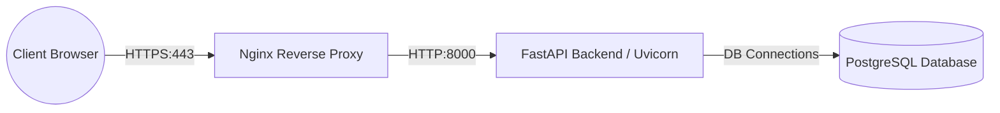
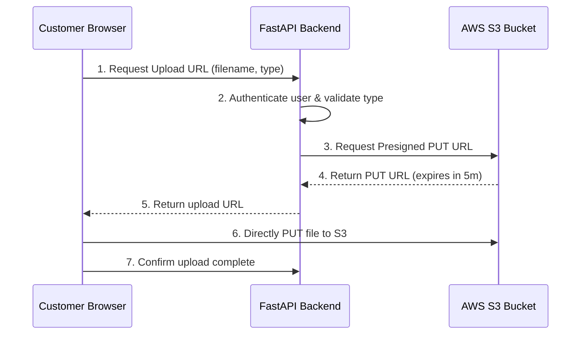

# Production Security Hardening & Deployment Checklist

This document details the operational configuration, network infrastructure setups, and cloud design patterns required to transition the FASTag Management Portal safely into production.

---

## 1. Network & Reverse Proxy Architecture

In a production environment, the FastAPI backend should run behind a robust reverse proxy (such as Nginx or AWS Application Load Balancer). The proxy terminates SSL/TLS, manages header redirection, and enforces request size boundaries.



### Nginx Secure Server Block Example

Below is a secure Nginx configuration for serving the FASTag APIs, including TLS requirements, secure response headers, and request rate-limiting configs.

```nginx
# Rate Limiting Zones definition
limit_req_zone $binary_remote_addr zone=api_limit:10m rate=10r/s;

server {
    listen 80;
    server_name api.fastagportal.com;
    return 301 https://$host$request_uri;
}

server {
    listen 443 ssl http2;
    server_name api.fastagportal.com;

    # SSL Certificates Configuration
    ssl_certificate /etc/letsencrypt/live/api.fastagportal.com/fullchain.pem;
    ssl_certificate_key /etc/letsencrypt/live/api.fastagportal.com/privkey.pem;

    # Secure SSL Protocols and Ciphers (Mozilla Modern Profile)
    ssl_protocols TLSv1.2 TLSv1.3;
    ssl_ciphers ECDHE-ECDSA-AES128-GCM-SHA256:ECDHE-RSA-AES128-GCM-SHA256:ECDHE-ECDSA-AES256-GCM-SHA384:ECDHE-RSA-AES256-GCM-SHA384:ECDHE-ECDSA-CHACHA20-POLY1305:ECDHE-RSA-CHACHA20-POLY1305:DHE-RSA-AES128-GCM-SHA256:DHE-RSA-AES256-GCM-SHA384;
    ssl_prefer_server_ciphers off;
    ssl_session_timeout 1d;
    ssl_session_cache shared:SSL:10m;
    ssl_session_tickets off;

    # HSTS (HTTP Strict Transport Security) - 1 year
    add_header Strict-Transport-Security "max-age=31536000; includeSubDomains; preload" always;

    # Security Headers
    add_header X-Frame-Options "DENY" always;
    add_header X-Content-Type-Options "nosniff" always;
    add_header X-XSS-Protection "1; mode=block" always;
    add_header Content-Security-Policy "default-src 'none'; frame-ancestors 'none'; sandbox;" always;
    add_header Referrer-Policy "strict-origin-when-cross-origin" always;

    location / {
        limit_req zone=api_limit burst=20 nodelay;

        proxy_pass http://127.0.0.1:8000;
        proxy_http_version 1.1;
        proxy_set_header Upgrade $http_upgrade;
        proxy_set_header Connection 'upgrade';
        
        # Propagate real client IP headers to Uvicorn
        proxy_set_header Host $host;
        proxy_set_header X-Real-IP $remote_addr;
        proxy_set_header X-Forwarded-For $proxy_add_x_forwarded_for;
        proxy_set_header X-Forwarded-Proto $scheme;
    }

    # Restrict request size for attachment safety (max 10MB)
    client_max_body_size 10M;
}
```

### Uvicorn Proxy Trust Settings

When launching Uvicorn inside the container or VM, configure it to trust the headers sent by Nginx. Run the server using:

```bash
uvicorn app.main:app --host 127.0.0.1 --port 8000 --proxy-headers --forwarded-allow-ips="127.0.0.1"
```

---

## 2. Cloud File Storage Transition (AWS S3)

Storing uploaded assets directly on the local server disk is an anti-pattern for horizontal scaling and introduces directory traversal risks. Transition to a cloud bucket (e.g. AWS S3) and deliver files via **Presigned URLs**.

### Presigned URL Flow



### Python AWS S3 Client Helper

Replace local file writers with this class:

```python
import boto3
from botocore.exceptions import ClientError
import logging
import os

class CloudStorageService:
    def __init__(self):
        self.s3_client = boto3.client(
            's3',
            aws_access_key_id=os.getenv("AWS_ACCESS_KEY_ID"),
            aws_secret_access_key=os.getenv("AWS_SECRET_ACCESS_KEY"),
            region_name=os.getenv("AWS_REGION", "ap-south-1")
        )
        self.bucket_name = os.getenv("AWS_S3_BUCKET_NAME")

    def generate_upload_url(self, object_name: str, expiration=300) -> str:
        """Generate a presigned URL to upload a file directly to S3"""
        try:
            response = self.s3_client.generate_presigned_url(
                'put_object',
                Params={'Bucket': self.bucket_name, 'Key': object_name},
                ExpiresIn=expiration
            )
            return response
        except ClientError as e:
            logging.error(f"S3 client error generating upload URL: {e}")
            return None

    def generate_download_url(self, object_name: str, expiration=900) -> str:
        """Generate a presigned URL to download a file with limited lifetime"""
        try:
            response = self.s3_client.generate_presigned_url(
                'get_object',
                Params={'Bucket': self.bucket_name, 'Key': object_name},
                ExpiresIn=expiration
            )
            return response
        except ClientError as e:
            logging.error(f"S3 client error generating download URL: {e}")
            return None
```

---

## 3. Environment & Configuration Security

Hardcoded secrets or plaintext configuration files must not exist in version control.

### Secret Management Rules
1. **Never commit `.env` files**: Add `.env` to `.gitignore`. Keep `.env.example` committed with blank placeholder variables.
2. **Production Secrets Storage**: Load credentials from secure environments:
   * **AWS**: Systems Manager Parameter Store or Secrets Manager.
   * **Kubernetes**: Kubernetes Secrets mounted as env variables.
   * **Docker Swarm**: Docker Secrets.
3. **Application Configuration Model**:
   Validate configurations on startup using `pydantic-settings`:

```python
from pydantic_settings import BaseSettings

class Settings(BaseSettings):
    DATABASE_URL: str
    SECRET_KEY: str
    ALGORITHM: str = "HS256"
    ALLOWED_ORIGINS: str
    AWS_ACCESS_KEY_ID: str
    AWS_SECRET_ACCESS_KEY: str
    AWS_S3_BUCKET_NAME: str

    class Config:
        env_file = ".env"
        extra = "ignore"

settings = Settings()
```

---

## 4. Session & Cookie Hardening

For browsers to transmit session credentials securely, set up cookie parameters as follows:

```python
response.set_cookie(
    key="access_token",
    value=token,
    httponly=True,       # Mitigates XSS cookie theft
    secure=True,         # Ensures cookies are only sent over HTTPS connections
    samesite="strict",   # Protects against CSRF attacks
    domain="fastagportal.com", # Set explicitly to the root domain or subdomain
    max_age=12 * 3600    # Short-lived sessions (12 hours)
)
```

---

## 5. Database Connection and Schema Security

### Production Connection Pooling
Configure SQLAlchemy in [database.py](file:///c:/Gi%20Internship/backend/app/database.py) to prevent connection starvation and handle network disruptions:

```python
engine = create_engine(
    DATABASE_URL,
    pool_size=20,          # Minimum connections to maintain
    max_overflow=10,       # Temporary connections to allow above pool_size
    pool_timeout=30,       # Wait threshold for connections before raising error
    pool_recycle=1800,     # Recycle connections after 30 minutes
    connect_args={"sslmode": "require"} # Force TLS connection to Postgres
)
```

### Database Hardening Tasks
* **Strict Least Privilege**: The application database user should only have `SELECT`, `INSERT`, `UPDATE`, and `DELETE` privileges. Do not run the application using DB owners or superuser roles.
* **Encryption at Rest**: Enable AWS Aurora/RDS KMS encryption on database volumes.

---

## 6. Security Hardening Checklist

Go-live verification checklist:

### Network & Infrastructure
- [ ] TLS 1.2/1.3 is configured on the reverse proxy.
- [ ] Host Header Validation is active in the proxy configuration.
- [ ] Strict-Transport-Security (HSTS) headers are active on all responses.
- [ ] Uvicorn is bound to local loopback (`127.0.0.1`) and not `0.0.0.0`.
- [ ] Rate limits are active on all authentication and user endpoints.

### Secret Management
- [ ] Fallback keys in JWT files have been removed; app crashes if `SECRET_KEY` is not in env.
- [ ] AWS credentials are loaded via IAM instance roles or secure task roles (no static keys on VMs).
- [ ] Credentials for database, SMTP, and encryption are rotated periodically.

### Application Logic
- [ ] Local static directories (`/uploads`) are disabled; files are stored on secure Cloud Storage.
- [ ] Row locks are integrated on wallets to prevent concurrency errors.
- [ ] Whitelist validation is active on all file upload extensions.
- [ ] Password reset tokens are stored as SHA-256 hashes in the database.
- [ ] JWT tokens are transmitted via HttpOnly, Secure, SameSite=Strict cookies.

### Database & Logging
- [ ] Connection pool limits are defined; DB queries enforce TLS connection requirements.
- [ ] Unique constraints are verified on the `fastag_inventory` schema.
- [ ] The audit logging helper extracts client IPs from `X-Forwarded-For` or `X-Real-IP`.
- [ ] Commits inside loops are resolved, using unit of work transactions.
